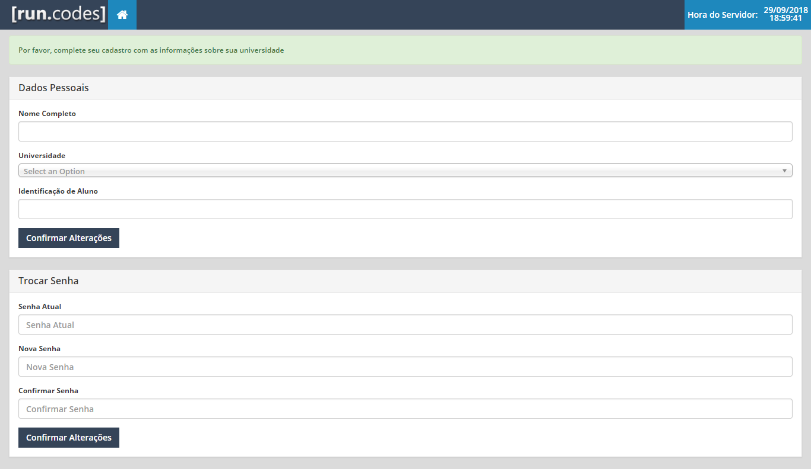

## Cadastro no run.codes

1. Acesse o endereço https://run.codes
2. Clique no botão "Cadastre-se Agora!"
3. Preencha seus dados de cadastro
4. Clique em Enviar

Uma mensagem será enviada ao email informado para confirmação do cadastro. Note que está mensagem pode levar até 15 minutos para ser recebida. Caso você não tenha recebido o email, verifique sua caixa de spam.

Se você não conseguir confirmar o cadastro, entre em contato com support@run.codes

## Primeiro Acesso
No primeiro acesso, você deverá informar sua universidade e número de matrícula.

Caso a sua universidade não apareça na lista, entre em contato com support@run.codes.

---

Escrito por Fabio Sikansi em 27/09/2018
