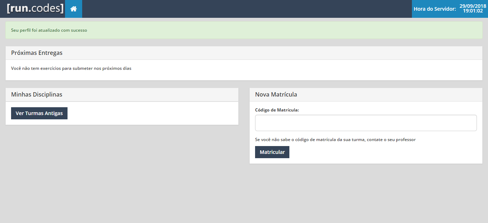

# Matrícula em Disciplina

1. Acesse sua home page https://run.codes/home

2. Digite o código que recebeu em "Código de Matrícula" (Caso ainda não tenha criado uma disciplina, consulte [Cadastro Professor](cadastroProfessor.md)).

3. Clique em "Matricular"

Seu navegador irá redireciona-lo para a página da disciplina matriculada.

---
