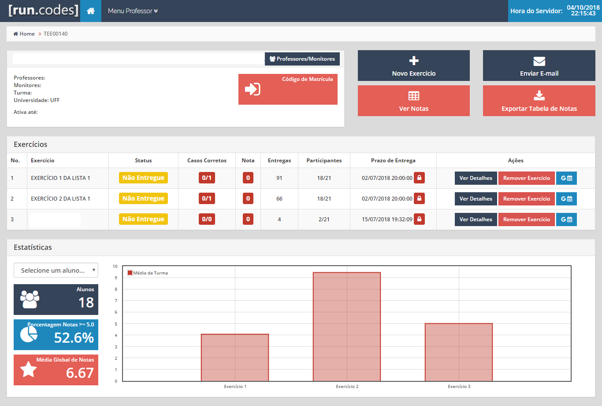
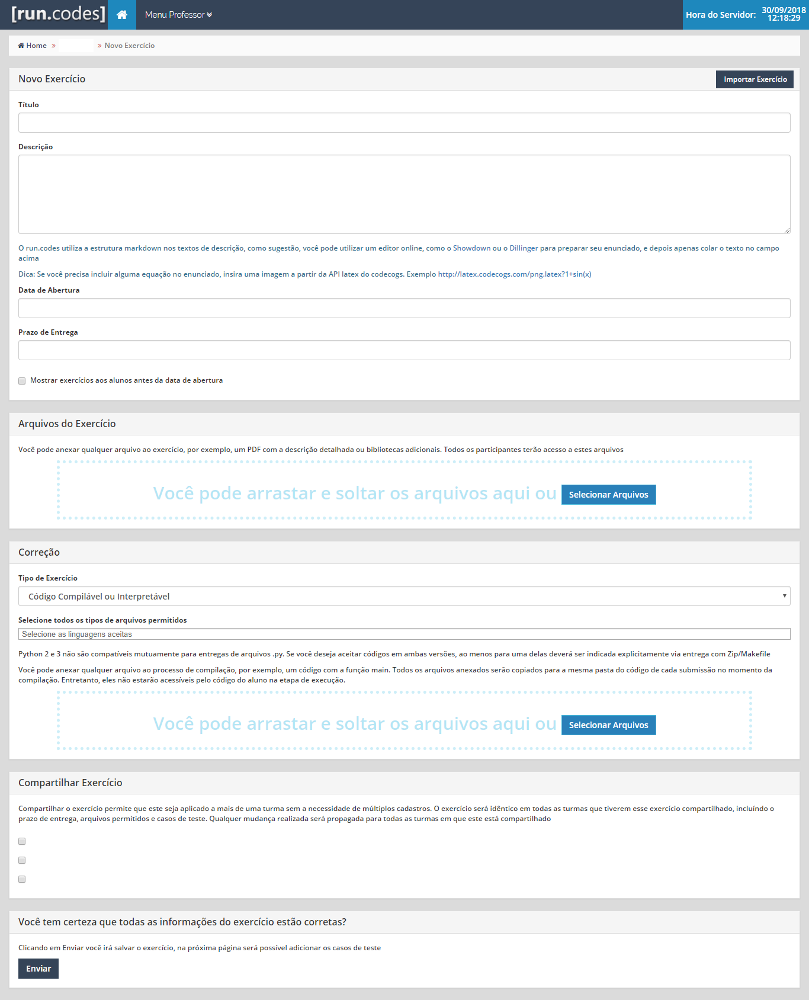

# Inserção de Novo Exercício

1. Acesse sua home page https://run.codes/home

2. Selecione a disciplina em que deseja criar o exercício (caso não tenha disciplinas consulte [Matrícula em Disciplina](matriculaDisciplina.md)).

3. Clique em "Novo Exercício"

4. Preencha os dados do exercício

---
### Dados do Exercício

#### Título

Basta inserir o título do exercício.

#### Descrição

Enunciado do exercício. Descreva a proposta do exercício, informando os alunos seu objetivo e a formatação de saída esperada. Todos os participantes poderão vizualizar esse texto.

###### OBS: Markdown
O run.codes utiliza a estrutura markdown no campo de descrição, como sugestão, você pode utilizar um editor online, como o Showdown ou o Dillinger para preparar seu enunciado, e depois apenas colar o texto no campo acima. Para mais informações https://guides.github.com/features/mastering-markdown/

**Dica**: Se você precisa incluir alguma equação no enunciado, insira uma imagem a partir da API latex do codecogs. Exemplo http://latex.codecogs.com/png.latex?1+sin(x)

#### Data de Abertura

A partir desta data os alunos poderão inserir suas respostas para o exercicio e iniciarem a avalição.

Caso deseje que os alunos vejam a proposta do exercício antes de ser aberto, basta marcar a checkbox escrito: "Mostrar exercícios aos alunos antes da data de abertura".

#### Prazo de Entrega

Prazo limite para os alunos inserirem suas respostas.

#### Arquivos do Exercício

Aqui devem ser inseridos os arquivos que são complemento a descrição do exercício ou fazem parte do problema.

Você pode anexar qualquer arquivo ao exercício, por exemplo, um PDF com a descrição detalhada ou **bibliotecas adicionais**. Todos os participantes terão acesso a estes arquivos

#### Correção

##### Tipo de exercício

O exercício pode ser de dois tipos:
* Código Compilável ou Interpretável
* Arquivo Simples

O primeiro refere-se a qualquer exercício de linguagens de programação em Linguagem compilada ou Linguagem interpretada. Formatos aceitos: **Haskel (".hs")**, **Portugol (".por")**, **C (".cpp")**, **Fortran (".f90")**, **ZIP Makefile (".zip")**, **Pascal (".pas")**, **Java 8 (".java")**, **C (".c")**, **Python 3 (".py")**.

O segundo refere-se a exercícios em arquivos de texto simples. Formatos aceitos: **Zip (".zip")**, **PDF (".pdf")** e **Texto (".txt")**.

---
